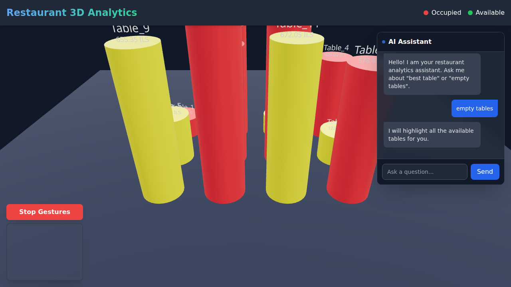

<div align="center">
  
  <h1>✨ Restaurant 3D Analytics Dashboard</h1>
</div>

<br/>

<table width="100%">
<tr>
<td width="50%" valign="top">

### 🇬🇧 English

#### The Vision: Bringing Data to Life
I created this project to bring a "wow-effect" back into data analytics. The goal was simple: to move away from boring, static Excel spreadsheets and create an interactive experience that breathes life into business metrics.

Imagine a dashboard you can literally step into and interact with naturally. This prototype focuses on the restaurant niche, demonstrating how we can visualize daily revenue, table occupancy, and more—all within an immersive 3D space.

#### Core Features
- **Privacy First (Local Analytics):** Small businesses shouldn't worry about data leaks. The entire backend runs locally, reading and processing your CSV data safely without sending sensitive numbers to the cloud.
- **Interactive 3D Visualization:** We use React Three Fiber to build a dynamic scene where table height represents revenue and color represents occupancy.
- **AI Assistant:** Instead of clicking through filters, you just ask questions. Type "best table" or "empty tables," and the AI analyzes your data and dynamically highlights the results in the 3D world.
- **Gesture Control (Minority Report Style):** Using a webcam and MediaPipe hand tracking, you can spin the camera around your 3D restaurant using simple hand movements—perfect for impressive client presentations.

#### How to Run Locally

**1. Start the Secure Backend (Terminal 1)**
```bash
# Install dependencies
pip install pandas numpy fastapi uvicorn pydantic python-dotenv

# Run the API
python backend/main.py
```

**2. Start the 3D Frontend (Terminal 2)**
```bash
# Navigate to the frontend directory
cd frontend

# Install dependencies
npm install

# Start the dev server
npm run dev
```

Open your browser at `http://localhost:5173` to explore the dashboard.

<br/>
<div align="center">
  <i>A.S.P — с любовью к аналитике.</i>
</div>

</td>
<td width="50%" valign="top" dir="rtl" align="right">

### 🇮🇱 עברית

#### החזון: להפיח חיים בנתונים
יצרתי את הפרויקט הזה כדי להחזיר את "אפקט הוואו" לעולם ניתוח הנתונים. המטרה הייתה פשוטה: להתרחק מטבלאות אקסל משעממות וסטטיות, וליצור חוויה אינטראקטיבית שמכניסה חיים למדדים עסקיים.

תארו לעצמכם לוח בקרה (דשבורד) שאתם יכולים ממש להיכנס אליו ולקיים איתו אינטראקציה בצורה טבעית. אב-טיפוס זה מתמקד בנישת המסעדות, ומדגים כיצד אנו יכולים להציג הכנסות יומיות, תפוסת שולחנות ועוד — הכל בתוך חלל תלת-ממד סוחף.

#### תכונות עיקריות
- **פרטיות מעל הכל (אנליטיקה מקומית):** עסקים קטנים לא צריכים לדאוג מדליפות נתונים. מערכת השרת (Backend) פועלת כולה באופן מקומי, קוראת ומעבדת את קובצי ה-CSV שלך בצורה מאובטחת מבלי לשלוח מספרים רגישים לענן.
- **ויזואליזציה בתלת-ממד:** אנו משתמשים ב-React Three Fiber כדי לבנות סצנה דינמית בה גובה השולחן מייצג הכנסות והצבע מייצג תפוסה.
- **עוזר בינה מלאכותית (AI):** במקום ללחוץ על מסננים, פשוט שואלים שאלות. תקליד "empty tables" (שולחנות פנויים), וה-AI מנתח את הנתונים שלך ומדגיש את התוצאות בצורה חיה בעולם התלת-ממד.
- **שליטה באמצעות מחוות ידיים:** בעזרת מצלמת רשת וטכנולוגיית מעקב הידיים MediaPipe, ניתן לסובב את המצלמה סביב המסעדה בתלת-ממד על ידי תנועות ידיים פשוטות — מושלם למצגות מרשימות ללקוחות.

#### איך להפעיל את הפרויקט

**1. הפעלת השרת המקומי (מסוף 1)**
```bash
# התקנת ספריות
pip install pandas numpy fastapi uvicorn pydantic python-dotenv

# הרצת ה-API
python backend/main.py
```

**2. הפעלת הממשק התלת-ממדי (מסוף 2)**
```bash
# כניסה לתיקיית הממשק
cd frontend

# התקנת חבילות
npm install

# הפעלת שרת הפיתוח
npm run dev
```

יש לפתוח את הדפדפן בכתובת `http://localhost:5173` כדי לראות את הפרויקט.

<br/>
<div align="center">
  <i>A.S.P — באהבה לאנליטיקה.</i>
</div>

</td>
</tr>
</table>